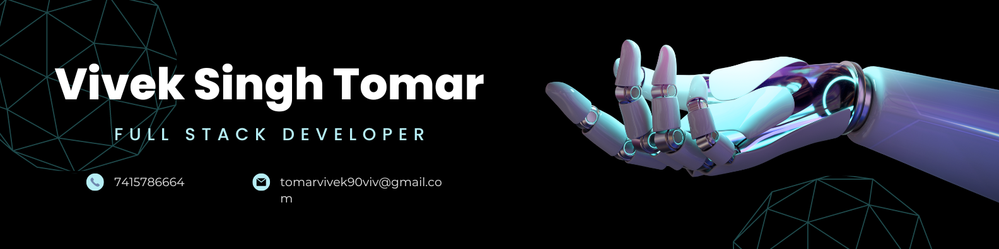

  

 

<h1 align="center"><TT >Hi 👋, I'm Vivek Singh Tomar</TT></h1>

<h3 align="center">Fullstack MERN Developer. I love to make projects with HTML, CSS, React JS, Redux, NodeJS, ExpressJS and MongoDB which are helpful for masses and serve as a great helpful entity.</h3>

 

  

  

  

- 🌱 I’m currently learning **Mern**
 
- 👨‍💻 All of my projects are available at --> <a href="https://github.com/VivekTomar03?tab=repositories" target="_blank">Repositories</a>

- 💬 Ask me about **React , APIs , Alogorithm**

- 📫 How to reach me -->  **tomarvivek90viv@gmail.com**

- 📄 Know about my experiences --><a href="https://drive.google.com/file/d/11EtYbNr4U93xYuxwI2VPvYyidMa9j9gJ/view?usp=drive_link" target="_blank">Resume</a>

- My Portfolio -->  

<h3 align="left">Connect with me:</h3>

  

    
    
    
    
   

  

<!-- 

  

 -->

<h3 align="left">Languages and Tools:</h3>

           

&nbsp;

